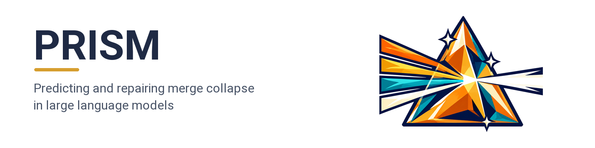
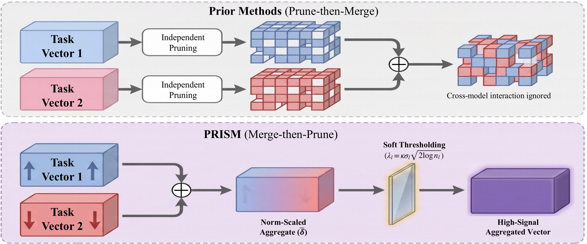
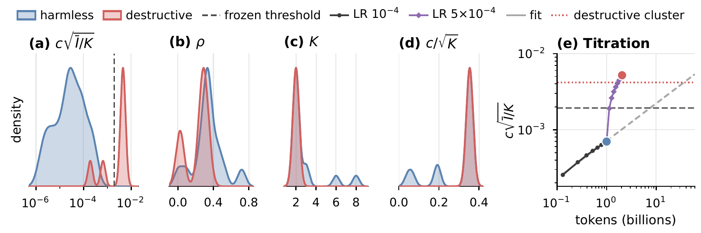

<p align="center">
  
</p>

<div align="center">

[](LICENSE)
[](https://creativecommons.org/licenses/by/4.0/)
[](https://www.python.org/)
[](https://github.com/js-lee-AI/PRISM/stargazers)

<b><a href="#quick-start">Quick start</a> · <a href="#usage">Usage</a> · <a href="#command-line">CLI</a> · <a href="#results">Results</a> · <a href="#reproduce-the-paper">Reproduce</a> · <a href="#faq">FAQ</a> · <a href="#citation">Citation</a></b>

</div>

---

## News

- **[2026-09-28]** Code released, together with the layer statistics of every merge the paper screens and the scripts that rebuild its screening tables and Figure 4 from them on a CPU.

## Overview

Large language models fine-tuned from a shared base can be merged by averaging their task vectors, but some merges collapse far below the base model, and common merge operators give no warning before evaluation. PRISM gives that warning from the weights alone and repairs the merges it flags.

It rests on three ideas.

* **Interference is the variance across specialists.** The power that averaging removes equals the variance of the task vectors across specialists, computed from the weights in the same pass as the average.
* **One score predicts collapse.** The disturbance a merge injects grows with the merge coefficient c and with interference, which gives the pre-merge score c√(Ī/K). On twenty-two merge configurations from four model families, only destructive merges exceed its threshold of 1.9 × 10<sup>-3</sup> (paper Table 4).
* **The same variance calibrates the repair.** PRISM averages the task vectors first and then soft-thresholds each layer at a level set by the layer's interference. Without data or tuning, it keeps all five destructive merges above the threshold within evaluation noise of the base model, where plain averaging falls at least 14.4 points below it or collapses entirely.

```
I = Var_k(s_k τ_k)        score = c √(Ī / K)        λ_l = κ σ_l √(2 log n_l),  σ_l² = Ī_l
```

A gate on the share of interference that comes from cancellation, ρ, returns the plain average when that share is below τ<sub>g</sub> = 0.1, which leaves one-sided drift intact. The recipe of the paper averages plainly below the score threshold and applies PRISM above it.

This repository is PRISM as a small library, plus the layer statistics and scripts that reproduce the paper.

## What it does in one picture

<p align="center">
  
</p>

<p align="center"><em>Merge then prune. Prior methods prune task vectors before aggregation, while PRISM averages first with norm scaling and then soft-thresholds the aggregate at the layer's interference scale (paper Figure 1).</em></p>

## Quick start

```bash
pip install "git+https://github.com/js-lee-AI/PRISM.git"
```

```python
import numpy as np
import prism

rng = np.random.default_rng(0)
base = {"w": rng.normal(0, 0.02, (512, 1024))}
shared = (rng.random((512, 1024)) < 0.005) * 0.2      # an update both specialists agree on
specialists = [{"w": base["w"] + shared + rng.normal(0, 0.02, (512, 1024))} for _ in range(2)]

print(prism.analyze(base, specialists))               # screen before merging

target = 0.5 * shared                                 # what a clean merge adds at c = 1/K
for name, denoise in [("plain average", False), ("PRISM", True)]:
    merged, info = prism.merge(base, specialists, denoise=denoise)
    err = np.linalg.norm(merged["w"] - base["w"] - target) / np.linalg.norm(target)
    print(f"{name:14s} error {err:.2f}   weights changed {100 * info['mean_keep_rate']:.1f}%")
# K=2  c=0.500  scales=[1.000, 0.998]
# score=4.989e-03  threshold=1.9e-03  rho=0.361 (thresholding on)
# -> above the threshold, merge with PRISM
# plain average  error 1.00   weights changed 100.0%
# PRISM          error 0.37   weights changed 0.5%
```

This runs on a CPU in well under a second and downloads nothing. The same code is [`examples/quickstart.py`](examples/quickstart.py), and CI runs it on every push. Each toy specialist adds its own noise to a shared sparse update, so the plain average writes a disturbance as large as the shared update into every weight. PRISM keeps the shared coordinates and drops the rest, and its remaining error is the shrinkage of the kept coordinates by λ.

| install | adds | enough for |
|---|---|---|
| `pip install "git+https://github.com/js-lee-AI/PRISM.git"` | numpy | the core API, the quickstart, `prism-merge score` on layer-statistic files |
| `pip install "prism-merge[merge] @ git+https://github.com/js-lee-AI/PRISM.git"` | torch, safetensors, huggingface_hub, transformers | screening and merging real checkpoints |
| `pip install "prism-merge[eval] @ git+https://github.com/js-lee-AI/PRISM.git"` | accelerate, datasets, lm-evaluation-harness | `experiments/evaluate.py` |
| `git clone` and then `pip install -e ".[merge,eval,plot,test]"` | matplotlib, pytest | `experiments/`, `data/` and `tests/` |

The paper's merges and evaluations ran with Python 3.11.14, PyTorch 2.4.0, Transformers 4.44.1, lm-evaluation-harness 0.4.11 and CUDA 12.1 on NVIDIA A100 80GB GPUs. CI runs the CPU tests on Python 3.10 and 3.13, and the torch path against the numpy core with CPU torch on Python 3.12.

## Usage

### Screen a candidate merge

```python
import prism

report = prism.screen_checkpoints("Qwen/Qwen2.5-7B", ["Qwen/Qwen2.5-Math-7B", "Qwen/Qwen2.5-Coder-7B"])
print(report)
# K=2  c=0.500  scales=[0.841, 1.000]
# score=4.251e-03  threshold=1.9e-03  rho=0.293 (thresholding on)
# -> above the threshold, merge with PRISM
```

Nothing is merged or evaluated. The checkpoints stream one matrix at a time, and the statistics take about two CPU-minutes on a 7B model (paper Section 3.1). Any Hub id or local folder with safetensors weights and Hugging Face parameter names works, as long as all models share the base.

### Merge

```python
import prism

merged, info = prism.merge_checkpoints(
    "Qwen/Qwen2.5-7B", ["Qwen/Qwen2.5-Math-7B", "Qwen/Qwen2.5-Coder-7B"],
    out="merged/qwen7b_math_coder", device="cuda")
print(info["rho"], info["gated"], info["mean_keep_rate"])
```

The defaults are those of the paper, with c = 1/K, κ = 1.0, τ<sub>g</sub> = 0.1, a keep-rate floor of 0.1% for each matrix and min-norm scaling s<sub>k</sub> = min<sub>j</sub> ‖τ<sub>j</sub>‖ / ‖τ<sub>k</sub>‖. PRISM merges the MLP projections and leaves attention, embeddings, norms and the output head at their base values (paper Section 4.3). `denoise=False` gives the plain average with the same scaling and coefficient, which is the Task Arithmetic of the paper's tables, and `norm_scaling=False` gives a raw merge.

### Weights you already hold in memory

```python
merged, info = prism.merge(base, specialists)       # dicts of parameter name to numpy array
report = prism.analyze(base, specialists)           # the same statistics, without merging
```

Keys named like Hugging Face MLP projections are grouped by decoder layer, and any other key is treated as a layer of its own unless `layers` groups them. Keys outside the merged layers keep their base values.

### API at a glance

| call | what it does | needs |
|---|---|---|
| `prism.analyze(base, specialists)` | score, ρ and layer statistics of a merge held in memory | base install |
| `prism.merge(base, specialists, denoise=True)` | PRISM, or the plain average, on arrays | base install |
| `prism.load_stats(path)` | reads a layer-statistic file into the same report | base install |
| `prism.rival_statistics(report)` | the five pre-merge statistics of paper Table 18 | base install |
| `prism.screen_checkpoints(base, specialists)` | score and ρ from Hub ids or local folders | `[merge]` |
| `prism.merge_checkpoints(base, specialists, out=...)` | PRISM on checkpoints, saved as a Hugging Face model | `[merge]` |

Calls marked base install import without torch. `prism.checkpoints` loads the first time one of its names is used.

## Command line

Installing the package adds a `prism-merge` command, and `python -m prism` runs the same thing.

```bash
prism-merge --help
prism-merge demo                                   # the quickstart, on CPU
prism-merge screen --base Qwen/Qwen2.5-7B --specialists Qwen/Qwen2.5-Math-7B Qwen/Qwen2.5-Coder-7B --out stats.json
prism-merge score stats.json                       # score and rho again, from the saved statistics
prism-merge merge --base Qwen/Qwen2.5-7B --specialists Qwen/Qwen2.5-Math-7B Qwen/Qwen2.5-Coder-7B --out merged/prism
prism-merge merge --base Qwen/Qwen2.5-7B --specialists Qwen/Qwen2.5-Math-7B Qwen/Qwen2.5-Coder-7B --average --out merged/task_arithmetic
```

In a clone, `prism-merge score data/layer_stats/*.json` scores every merge of the paper in under a second.

## Results

Across twenty-two merges from four model families, the interference score exceeded its threshold only for destructive merges, and twelve of the fourteen predictions made before evaluation were correct.

<p align="center">
  
</p>

<p align="center"><em>(a) Densities of the interference score by outcome. (b) to (d) Densities of ρ, K and c/√K overlap. (e) At the lower learning rate, the score grows roughly as the square root of specialist training tokens, and large markers are evaluated merges (paper Figure 4).</em></p>

### The score against the outcome of 22 merges (paper Table 4)

Seven merges are destructive, with perplexity above 100 or a six-task mean more than 10 points below the base, and fifteen are harmless, within 1 point or better. The score is in units of 10<sup>-3</sup>, and the three right columns are six-task means.

| setting | K | c | ρ | c√(Ī/K) | base | TA | PRISM |
|---|---|---|---|---|---|---|---|
| *naive averaging destroys the model* | | | | | | | |
| Qwen2.5-1.5B ja + med, constructed ⋆ | 2 | 0.50 | 0.342 | 5.19 | 56.1 | 35.8 | 55.9 |
| Qwen2.5-1.5B Math + Coder | 2 | 0.50 | 0.246 | 4.94 | 56.3 | 37.1 | 55.8 |
| Qwen2.5-7B Math + Coder | 2 | 0.50 | 0.293 | 4.25 | 68.0 | 49.5 | 67.8 |
| Qwen2.5-7B R1-Distill + Coder ⋆ | 2 | 0.50 | 0.291 | 4.24 | 68.1 | 49.7 | 67.7 |
| Qwen2.5-7B Math-PRM + Coder ⋆ | 2 | 0.50 | 0.285 | 4.17 | 68.1 | 53.7 | 67.6 |
| Qwen2.5-7B Math + Finance ⋆ | 2 | 0.50 | 0.036<sup>g</sup> | 0.653 | 68.1 | 37.0 | 37.0<sup>g</sup> |
| Qwen2.5-7B Coder + Coder-Instruct ⋆ | 2 | 0.50 | 0.013<sup>g</sup> | 0.190 | 68.1 | 39.3 | 39.3<sup>g</sup> |
| *merging is harmless* | | | | | | | |
| DeepSeek-7B math + chat | 2 | 0.50 | 0.348 | 0.228 | 46.8 | 48.1 | 46.6 |
| Qwen2.5-7B self-SFT at 10× learning rate ⋆ | 2 | 0.50 | 0.349 | 0.227 | 68.1 | 68.8 | 68.2 |
| Llama-3.1-8B R1-Distill + Tulu-3 ⋆ | 2 | 0.50 | 0.346 | 0.089 | 59.3 | 62.6 | 59.6 |
| Qwen2.5-7B Aloe medical + Math ⋆ | 2 | 0.50 | 0.279 | 0.082 | 68.1 | 68.0 | 68.1 |
| Qwen2.5-7B HuatuoGPT + R1-Distill ⋆ | 2 | 0.50 | 0.349 | 0.076 | 68.1 | 68.9 | 68.1 |
| Qwen2.5-7B Math + Coder + Instruct | 3 | 0.33 | 0.443 | 0.042 | 68.0 | 68.6 | 68.1 |
| Mistral-7B MetaMath + Code | 2 | 0.50 | 0.093<sup>g</sup> | 0.030 | 57.4 | 59.9 | 59.9<sup>g</sup> |
| Qwen2.5-7B self-SFT, K = 2 | 2 | 0.50 | 0.333 | 0.027 | 68.1 | 68.4 | 68.2 |
| Mistral-7B SaulLM legal + BioMistral ⋆ | 2 | 0.50 | 0.322 | 0.025 | 57.3 | 57.8 | 57.4 |
| Qwen2.5-7B Math + EVA roleplay ⋆ | 2 | 0.50 | 0.229 | 0.019 | 68.1 | 68.1 | 68.1 |
| Llama-3.1-8B Swallow ja + Guard ⋆ | 2 | 0.50 | 0.290 | 0.012 | 60.2 | 60.0 | 59.7 |
| Llama-3.1-8B OpenMath2 + Hermes-3 + Guard | 3 | 0.33 | 0.435 | 0.008 | 60.2 | 60.0 | 59.7 |
| Qwen2.5-7B off-the-shelf ×6 | 6 | 0.17 | 0.516 | 0.005 | 68.1 | 68.0 | 68.2 |
| Qwen2.5-7B self-SFT, K = 8 | 8 | 0.13 | 0.720 | 0.003 | 68.1 | 68.0 | 68.0 |
| Llama-3.1-8B Tulu-3 + Tulu-3-DPO ⋆ | 2 | 0.50 | 0.003<sup>g</sup> | 0.002 | 59.3 | 64.5 | 64.5<sup>g</sup> |

⋆ marks an outcome predicted before evaluation, and <sup>g</sup> a merge whose ρ is below τ<sub>g</sub>, so PRISM equals Task Arithmetic (TA). The score exceeds the threshold of 1.9 × 10<sup>-3</sup> for five of the seven destructive merges and for none of the harmless ones. On R1-Distill + Coder and Math-PRM + Coder, two merges predicted to be destructive, naive averaging falls 18.4 and 14.4 points below the base, whereas PRISM keeps both within 0.5 points of it. Reproduce this table with `python experiments/table4_breadth.py`, which recomputes ρ and the score from the shipped layer statistics.

### Merging under severe conflict (paper Tables 1 and 2)

Six-task mean and separately prompted generation, with GSM8K 5-shot, MATH-500 4-shot and harness HumanEval and MBPP pass@1 with completion prompts. Bold marks the best merged model.

| method | six-task avg. | GSM8K | MATH | HumanEval | MBPP |
|---|---|---|---|---|---|
| *Qwen2.5-7B Math + Coder base checkpoints (Table 1)* | | | | | |
| Math specialist | 61.5 | 83.8 | 53.6 | 34.1 | 56.2 |
| Coder specialist | 64.8 | 82.4 | 41.4 | 59.8 | 68.4 |
| Task Arithmetic | 49.5 | 23.0 | 5.8 | 13.4 | 27.4 |
| TIES | 61.1 | 65.8 | 24.6 | 17.7 | 43.0 |
| DELLA | 60.3 | 64.0 | 22.0 | 17.7 | 42.4 |
| LEWIS† | 56.1 | 74.2 | 15.4 | 26.2 | 52.6 |
| **PRISM** | **67.8** | **82.4** | **30.2** | **51.2** | **62.8** |
| *Qwen2.5-1.5B Math + Coder instruction-tuned checkpoints (Table 2)* | | | | | |
| Task Arithmetic | 37.1 | 4.0 | 1.8 | 0.0 | 0.0 |
| TIES | 42.6 | 19.0 | 3.8 | 11.6 | 16.2 |
| LEWIS† | 52.3 | 35.6 | 13.6 | 28.0 | 38.6 |
| **PRISM** | **55.8** | **59.0** | **26.6** | **35.4** | **43.0** |

† LEWIS uses calibration data. In Table 1, PRISM leads Task Arithmetic, TIES and DELLA on the six-task mean by at least 6.7 points and leads every baseline on all four generation metrics. `bash experiments/main_merges.sh qwen7b` and `qwen1.5b` rebuild the six-task means of the Task Arithmetic and PRISM rows. The generation columns, the specialists and the baselines come from evaluation code outside this release.

### The size of the update (paper Table 3)

PRISM writes 2.2% of the norm of the plain average and changes 0.1% of the merged coordinates on Qwen2.5-7B Math + Coder, where the baseline operators and community defaults write updates with 46 to 285% of that norm.

| method | norm ‖δ‖/‖δ̄‖ | coords % |
|---|---|---|
| Task Arithmetic | 1.00 | 99.7 |
| Hard threshold, same λ | 0.126 | 0.1 |
| PRISM | 0.022 | 0.1 |

`python experiments/table3_update_norm.py` recomputes these cells on a CPU from the three checkpoints. The hard threshold keeps the same coordinates as PRISM without shrinking them.

### Rival pre-merge statistics (paper Table 18)

| statistic | AUC | margin | result |
|---|---|---|---|
| c√(Ī/K) (used) | 0.98 | 0.83× | predictive |
| c√(P̄/K) (total power) | 1.00 | 21.2× | separates |
| c√(S̄/K) (signal power) | 1.00 | 23.3× | separates |
| 1 − CR (mean incoherence) | 0.08 | < 0.01× | anti-predictive |
| ρ (cancellation ratio) | 0.25 | 0.02× | anti-predictive |

AUC treats larger scores as more destructive, and the margin is the smallest destructive value divided by the largest harmless one, over all 22 configurations of Table 4. Interference also sets the repair's variance scale, while mean incoherence and ρ, the statistics of sign conflict, are anti-predictive. Reproduce this table with `python experiments/table18_rival_statistics.py`.

### A controlled titration (paper Figure 4e and Section 5.7)

Two Qwen2.5-1.5B specialists were continued on disjoint Japanese web text and biomedical abstracts. At learning rate 10<sup>-4</sup>, eight measured checkpoints follow an approximate square-root law through a harmless endpoint at one billion tokens for each specialist, with a score of 0.699 × 10<sup>-3</sup>. Extrapolated, the fitted law crosses the threshold near 7.5 billion tokens and reaches 4.17 × 10<sup>-3</sup>, the lower edge of the destructive cluster in Table 4, near 36 billion. Continuing at 5× the rate reaches that cluster within a further billion tokens, and the merge at this endpoint is destructive as predicted. Naive averaging loses 20.3 points against the base, while PRISM stays within 0.3 points of it. Reproduce these numbers and Figure 4 with `python experiments/figure4_screening.py --plot results/figure4.png`.

### Screening public pairs (paper Appendix J)

The screen scored twenty-eight public pairs without a code specialist, fourteen on Qwen2.5-7B, eleven on Llama-3.1-8B and three on Mistral-7B. The scores range from 0.002 × 10<sup>-3</sup> to 0.853 × 10<sup>-3</sup>, all below half the threshold, and the largest belongs to Qwen2.5-7B R1-Distill + Math-PRM. Reproduce this with `python experiments/screened_pairs.py`.

## Reproduce the paper

```bash
git clone https://github.com/js-lee-AI/PRISM.git
cd PRISM
pip install -e ".[merge,eval,plot,test]"
```

The screening results are functions of per-layer statistics of the task vectors, and [`data/`](data/README.md) ships them for every merge the paper screens, together with the six-task means that decide each outcome. Each entry is one decoder layer of one candidate merge.

```json
{"n": 203685888, "I": 0.00011013453032826209, "C": 3.069451263359001e-05, "cr": 0.6548292784561065}
```

| paper | command | hardware | time |
|---|---|---|---|
| Table 4, ρ, score and outcomes | `python experiments/table4_breadth.py` | CPU | under 1 s |
| Table 18 | `python experiments/table18_rival_statistics.py` | CPU | under 1 s |
| Figure 4 and the titration of Section 5.7 | `python experiments/figure4_screening.py --plot results/figure4.png` | CPU | about 1 s |
| Appendix J, screened pairs | `python experiments/screened_pairs.py` | CPU | under 1 s |
| Table 4, the score of Qwen2.5-7B Math + Coder from its checkpoints | `prism-merge screen --base Qwen/Qwen2.5-7B --specialists Qwen/Qwen2.5-Math-7B Qwen/Qwen2.5-Coder-7B` | CPU | about 2 min |
| Table 3, Norm and Coords | `python experiments/table3_update_norm.py` | CPU | about 8 min |
| Tables 1 and 4, Qwen2.5-7B Math + Coder | `bash experiments/main_merges.sh qwen7b` | 1x A100 80GB | about 2 h |
| Tables 2 and 4, Qwen2.5-1.5B Math + Coder | `bash experiments/main_merges.sh qwen1.5b` | 1x A100 80GB | about 2 h |
| Table 4, Qwen2.5-7B Math + Coder + Instruct | `bash experiments/main_merges.sh qwen7b_k3` | 1x A100 80GB | about 2 h |

The CPU scripts print the rows they reproduce. `main_merges.sh` screens the pair, builds the PRISM and plain-average merges and evaluates them and the base with [`experiments/evaluate.py`](experiments/evaluate.py), which reports WikiText-2 perplexity and the six-task lm-evaluation-harness mean with GSM8K under strict-match extraction. A merge with perplexity above 100 counts as collapsed, and `--force` still runs the harness on it, as the Task Arithmetic column needs. The layer-statistic file of every Table 4 row names its base and specialists, so `prism-merge merge` rebuilds any row whose specialists are public.

## Repository layout

```
prism/core.py              statistics, score, rho-gate, soft thresholding and merge on arrays
prism/stats.py             layer-statistic files and the rival statistics of Table 18
prism/checkpoints.py       the same on safetensors checkpoints with torch
prism/cli.py               the prism-merge command
examples/quickstart.py     the CPU demo shown above
experiments/               one script per paper table or figure, and evaluate.py
data/                      layer statistics of every screened merge, outcomes, titration ladder
tests/                     fast CPU tests that CI runs
```

## FAQ

<details>
<summary><b>Do I need a GPU?</b></summary>

Not to screen. The score and ρ of every merge in the paper come from `data/` on numpy alone, and scoring new checkpoints streams one matrix at a time on a CPU. Merging runs on a CPU or one GPU, with a peak GPU footprint of a single 7B model, about 15 GB in bfloat16 (paper Appendix G). Only the evaluations need a GPU.

</details>

<details>
<summary><b>Should I always merge with PRISM?</b></summary>

No. Shrinkage helps a destructive merge but can forgo the gain that plain averaging brings to a harmless one, so the recipe averages plainly below the score threshold and applies PRISM above it (paper Section 5.7). All fifteen harmless configurations of Table 4 scored below the threshold and keep the plain average, which scores 62.6 against the base's 59.3 on Llama-3.1-8B R1-Distill with Tulu-3.

</details>

<details>
<summary><b>Does the score catch every destructive merge?</b></summary>

No. It flags five of the seven destructive merges in Table 4. The two below the threshold, Math + Finance and Coder + Coder-Instruct, are the two misses among the fourteen predictions made before evaluation, and in both ρ is below τ<sub>g</sub>, so PRISM returns Task Arithmetic there. None of the fifteen harmless merges exceeds the threshold.

</details>

<details>
<summary><b>Which models does it support?</b></summary>

Specialists fine-tuned from one shared base, stored as safetensors with Hugging Face parameter names. Table 4 covers Qwen2.5, Llama-3.1, Mistral-7B and DeepSeek-7B with two to eight specialists. Other decoder families with `model.layers.N.mlp.{gate,up,down}_proj` weights work unchanged, and the array API accepts any grouping of weights.

</details>

<details>
<summary><b>Why do my numbers differ from the paper?</b></summary>

The statistics sum over billions of coordinates, so a CPU and a GPU order the sums differently and agree only to the printed digits, as the screen above does for Table 4. The six-task means depend on the lm-evaluation-harness version and on the subsample and seed that `experiments/evaluate.py` sets by default.

</details>

<details>
<summary><b>How is this different from TIES, DARE or DELLA?</b></summary>

These prune-then-merge operators discard part of each task vector before averaging, and each sets its keep rate in advance, whatever the disagreement between the specialists. PRISM averages first and then soft-thresholds the average at a level set by each layer's interference, and the same statistic tells you before merging whether the merge needs it.

</details>

## Citation

If you use this code, please cite the paper.

```bibtex
@article{lee2026prism,
  title   = {Predicting and Repairing Merge Collapse in Large Language Models},
  author  = {Lee, Jungseob and Lee, Seungyoon and Eo, Sugyeong and Moon, Hyeonseok and Seo, Jaehyung and Lim, Heuiseok},
  year    = {2026}
}
```

The arXiv identifier is added here once it is assigned. The Cite this repository button in the GitHub sidebar gives the same entry from [`CITATION.cff`](CITATION.cff).

## License

Code is MIT, see [LICENSE](LICENSE). The paper is CC BY 4.0.

## Acknowledgments

PRISM builds on [Task Arithmetic](https://arxiv.org/abs/2212.04089), on the ambiguity decomposition of Krogh and Vedelsby (1994) and on the universal threshold of wavelet shrinkage of [Donoho and Johnstone (1994)](https://doi.org/10.1093/biomet/81.3.425). The evaluations use [lm-evaluation-harness](https://github.com/EleutherAI/lm-evaluation-harness), and the merges use public checkpoints from the Qwen, Llama, Mistral and DeepSeek families and their community fine-tunes.
